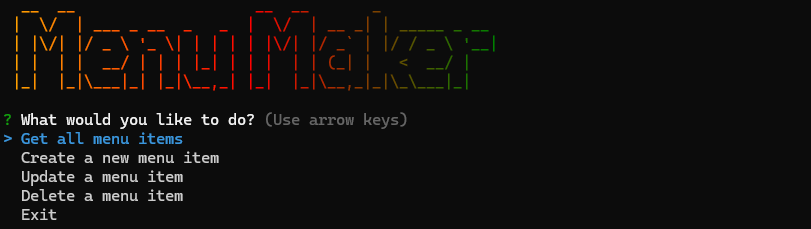

# Menu Maker Application



This is a simple command-line application that allows users to create a menu of items. Each menu item has its own name, price, and description. The application allows users to create, update remove, and display menu items. These menu items are stored in a Postgres database using Docker. The command line is built using Node.js, chalk, figlet, gradient-string, inquirer, and node-fetch.

You can do anything you want with this application. This is just meant to be a simple CRUD application that demonstrates how to use a Postgres database with Docker and Node.js. You can replace the command-line with a web interface, or you can add more features to the command-line interface.

## Installation

To install this application, you will need to have Docker installed on your machine. You can download Docker from the [official website](https://www.docker.com/).

Once you have Docker installed, you can clone this repository and run the following command to build the Docker image:

```bash
cd back-end
docker compose up
```

You can have the Docker container running in the terminal or through the Docker Desktop application.

To get the application running, you will need to install the dependencies for both the back-end and front-end. You can do this by running the following commands:

```bash
cd back-end
npm install
```

```bash
cd front-end
npm install
```

## Usage

In the back-end directory, you can run the following command to start the application:

```bash
nodemon .
```

In the front-end directory, you can run the following command to start the application:

```bash
node .
```